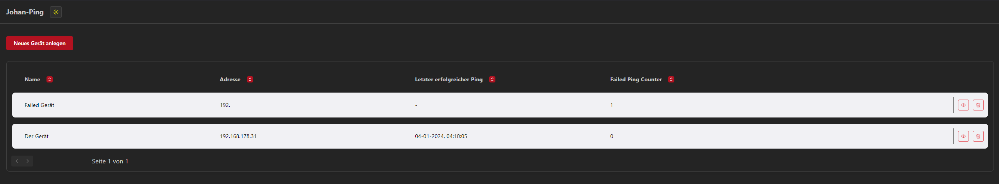
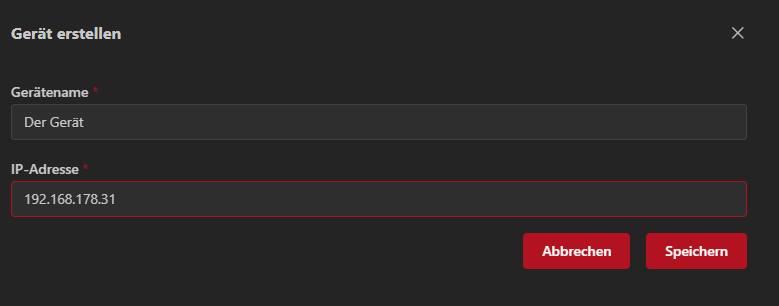
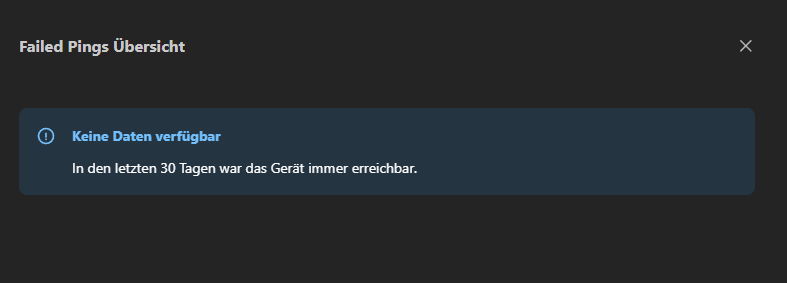
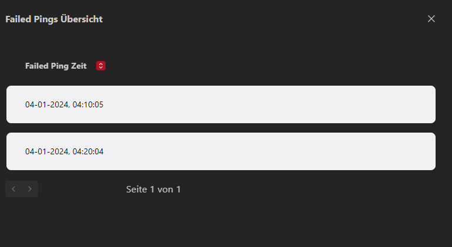

# Johan-Ping = Johannes + Ping :heart

## How to run
Install Docker on your System. On a Windows Maschine install Docker Desktop for easier Management. 
See Docker Install Docs for help --> https://docs.docker.com/engine/install/ \
For Docker Desktop on Windows --> https://docs.docker.com/desktop/install/windows-install/

After that follow these steps:
1. Start Docker Desktop
2. Install git (easiest way is to install gitbash https://git-scm.com/downloads)
3. Clone this Git Repo https://github.com/StitZle/johanping (`git clone https://github.com/StitZle/johanping.git`)
4. CD into source directory and execute Docker Compose Script. It will set everything up for you (niceee) \
   `$ cd johanping/` && $ `docker compose up -d`

## Usage
To view the website go to http://localhost:8080/
Website will work on Mobile (If you make the url available in your Home Network ...)

- Create Devices to Ping
- Delete Devices
- See Device Ping History
- Backend will automatically Ping all Devices every 10 minutes (timeout is 3s per Ping)
- Failed Ping Counter will reset on first successful ping

## Screenshots

